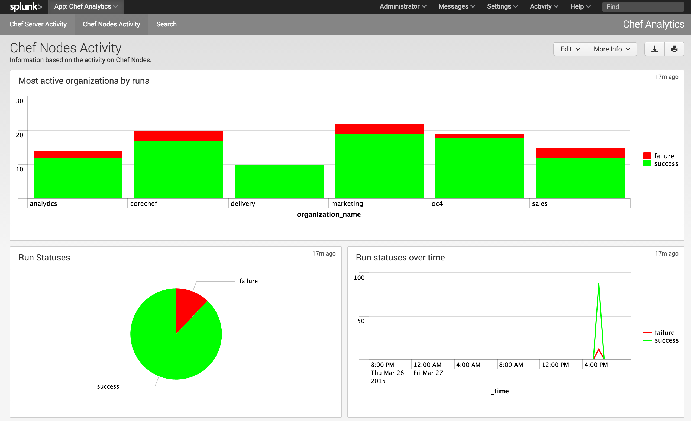
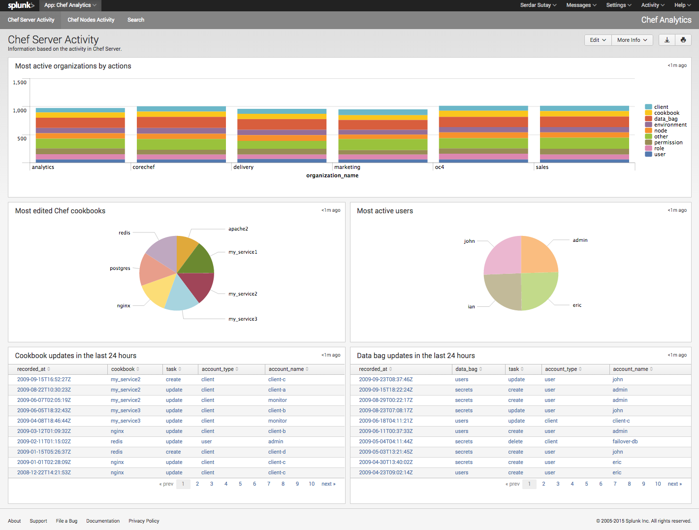

# Chef Analytics Splunk App

Splunk App to gather insights from your Chef infrastructure via Chef Analytics.

## Requirements:

* Chef Analytics 1.1.2 or later

## Screenshots:

### Nodes Activity Dashboard


### Server Activity Dashboard


## Setup:

1. [Download](https://downloads.chef.io/analytics/) and [install](https://docs.chef.io/install_analytics.html) Chef Analytics.
1. Enable integration service.
  * Add `features['integration'] = true` into `/etc/opscode-analytics/opscode-analytics.rb`
  * Run `opscode-analytics-ctl reconfigure`
1. Configure a notification for your Splunk Server:
  * Go to `Notifications` tab in your Analytics UI.
  * Click `+` and select `Splunk`.
  * Give your configuration a name for e.g. `my-splunk-notifier`
  * Configure `hostname`, `port`, `username` & `password` for your Splunk Server.
1. Create the necessary rules to send data to your Splunk Server. You will need 3 rules:
  ```
  rules 'splunk-actions'
    rule on action
    when
      true
    then
      notify("my-splunk-notifier", "message_type={{message.message_type}} organization_name={{message.organization_name}} service_hostname={{message.service_hostname}} recorded_at={{message.recorded_at}} remote_hostname={{message.remote_hostname}} request_id={{message.request_id}} requestor_name={{message.requestor_name}} requestor_type={{message.requestor_type}} user_agent={{message.user_agent}} id={{message.id}} task={{message.task}} entity_type={{message.entity_type}} entity_name={{message.entity_name}} remote_request_id={{message.remote_request_id}}")
    end
  end
  ```

  ```
  rules 'splunk-actions'
    rule on run_converge
    when
      true
    then
      notify("my-splunk-notifier", "message_type={{message.message_type}} id={{message.id}} run_id={{message.run_id}} node_name={{message.node_name}} organization_name={{message.organization_name}} chef_server_fqdn={{message.chef_server_fqdn}} run_list={{message.run_list}} start_time={{message.start_time}} end_time={{message.end_time}} status={{message.status}} total_resource_count={{message.total_resource_count}} updated_resource_count={{message.updated_resource_count}} error_class={{message.error.class}} error_message={{message.error.message}}")
    end
  end
  ```

  ```
  rules 'splunk-run-resources'
    rule on run_resource
    when
      true
    then
      notify("my-splunk-notifier", "message_type={{message.message_type}} id={{message.id}} cookbook_name={{message.cookbook_name}} cookbook_version={{message.cookbook_version}} duration={{message.duration}} resource_id={{message.resource_id}} resource_name={{message.resource_name}} resource_result={{message.resource_result}} resource_type={{message.resource_type}}")
    end
  end
  ```
1. Install Chef Analytics Splunk App in your Splunk Server

## Contributing

This project is maintained with [Chef Community Maintenance Policy](https://github.com/chef/chef-rfc/blob/master/rfc030-maintenance-policy.md).

If you have encountered a problem or if you have a feature request, create an issue [here](https://github.com/chef/analytics-splunk-app/issues/new).

[Send in a pull request](https://github.com/chef/analytics-splunk-app/pulls) if you'd like to contribute to this project.

## MAINTAINERS

* Serdar Sutay (serdar at chef dot io)

--------------------------------------------------------------------------------
Copyright:: Copyright (c) 2015 Chef Software, Inc.
License:: Apache License, Version 2.0

Licensed under the Apache License, Version 2.0 (the "License");
you may not use this file except in compliance with the License.
You may obtain a copy of the License at

    http://www.apache.org/licenses/LICENSE-2.0

Unless required by applicable law or agreed to in writing, software
distributed under the License is distributed on an "AS IS" BASIS,
WITHOUT WARRANTIES OR CONDITIONS OF ANY KIND, either express or implied.
See the License for the specific language governing permissions and
limitations under the License.
